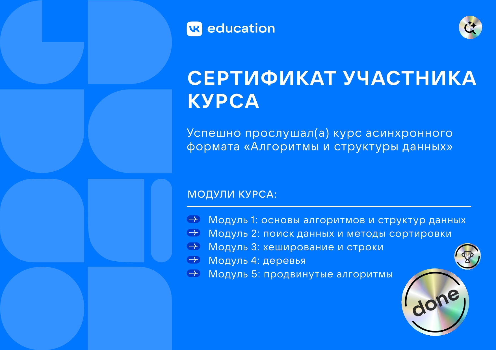

# 📌 Алгоритмы и структуры данных

## 📖 Описание
Этот репозиторий содержит мои решения задач с курса "Алгоритмы и структуры данных" (2025, https://education.vk.company/).

## 🎯 О курсе
Курс посвящен изучению фундаментальных алгоритмов и структур данных, которые являются основой эффективного программирования. Здесь вы найдете мои решения практических задач, выполненные в процессе обучения.

## 🎯 Цель
Освоить работу с алгоритмами и структурами данных, научиться решать алгоритмические задачи и писать эффективный код.

## 🎓 Сертификаты

  

